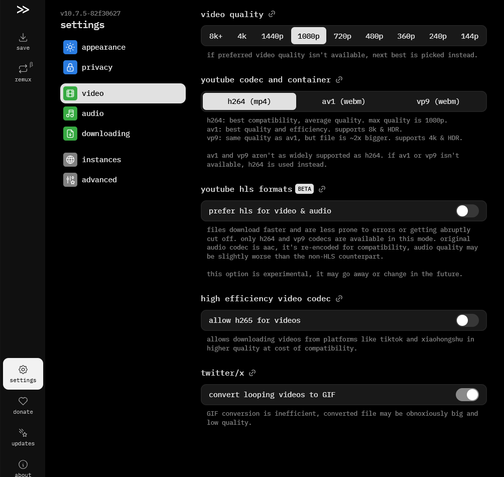

+++
date = '2025-02-27T21:51:20+08:00'
title = 'Cobalt'
categories = ['teknologi', 'software']
+++

---

# Cobalt.tools: Alat Unduh Konten Online yang Cepat dan Efisien

**Cobalt.tools** adalah layanan berbasis web yang memungkinkan pengguna mengunduh konten dari berbagai platform seperti YouTube, SoundCloud, Twitter, TikTok, dan lainnya. Alat ini terkenal karena kemudahan penggunaan, kecepatan, dan dukungannya terhadap format berkas yang beragam (video, audio, atau keduanya). Keunggulan lainnya adalah **tanpa iklan** dan fokus pada privasi pengguna.

---

## Fitur Utama Cobalt.tools
1. **Mendukung Banyak Platform**: YouTube, SoundCloud, TikTok, Twitter, Instagram, dll.
2. **Konversi Format**: Pilih antara video (MP4, WEBM) atau audio (MP3, WAV).
3. **Tanpa Iklan**: Antarmuka bersih dan bebas gangguan.
4. **Privasi Terjamin**: Tidak memerlukan login atau pelacakan data.
5. **Open Source**: Kode sumber tersedia di [GitHub](https://github.com/cobalt-org/cobalt.tools).

---

## Tutorial Menggunakan Cobalt.tools
Berikut langkah-langkah untuk mengunduh konten menggunakan Cobalt.tools:

### Langkah 1: Buka Situs Cobalt.tools
Akses [https://cobalt.tools](https://cobalt.tools) di browser Anda.  
  
*Gambar 1: Antarmuka utama Cobalt.tools.*

---

### Langkah 2: Salin URL Konten
Salin tautan (URL) dari video atau audio yang ingin diunduh. Contoh:  
- YouTube: `https://youtube.com/watch?v=contoh123`  
- TikTok: `https://tiktok.com/@user/video/123456`  

---

### Langkah 3: Tempel URL ke Cobalt.tools
Tempel tautan di kolom input Cobalt.tools dan klik **Download**.  
  
*Gambar 2: Tempel URL ke kolom input.*

---

### Langkah 4: Pilih Format dan Kualitas
Setelah tautan diproses, pilih format dan kualitas yang diinginkan:  
- **Video**: MP4 (1080p, 720p) atau WEBM.  
- **Audio**: MP3 (320kbps) atau WAV.  

 
 
*Gambar 3: Menu pilihan format dan kualitas.*

---

### Langkah 5: Unduh Konten
Klik **Download** untuk mengunduh berkas ke perangkat Anda.  

---

### Langkah 6: Cek Folder Unduhan
Berkas akan tersimpan di folder `Unduhan` (Downloads) di perangkat Anda.  

---

## FAQ (Pertanyaan Umum)
1. **Apakah Cobalt.tools legal?**  
   *Penggunaan harus sesuai dengan kebijakan platform sumber dan hukum setempat. Jangan unduh konten berhak cipta tanpa izin.*  
2. **Apakah ada batasan ukuran?**  
   *Tidak, selama server Cobalt.tools mendukung.*  
3. **Apakah Cobalt.tools berbayar?**  
   *Gratis, tetapi Anda bisa donasi untuk mendukung pengembang.*  
4. **Bagaimana cara mengatasi error?**  
   *Pastikan URL valid dan koneksi internet stabil.*  

---

## Catatan Penting
- Gunakan Cobalt.tools hanya untuk konten yang diperbolehkan oleh pemilik hak cipta.  
- Untuk konten privat (seperti Instagram Stories), pastikan Anda memiliki izin mengaksesnya.  

---

Dengan Cobalt.tools, mengunduh konten dari berbagai platform menjadi lebih mudah dan cepat. Selamat mencoba! 🚀