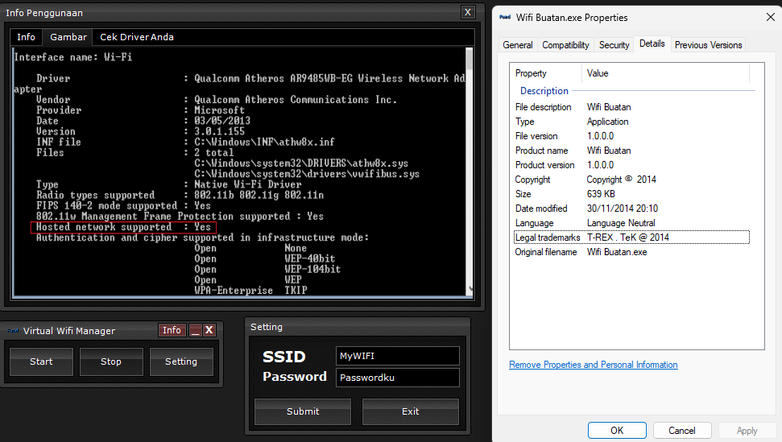
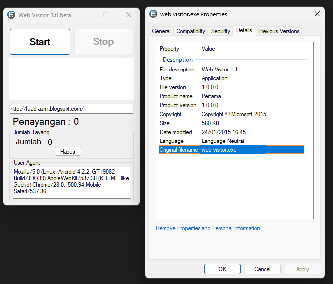
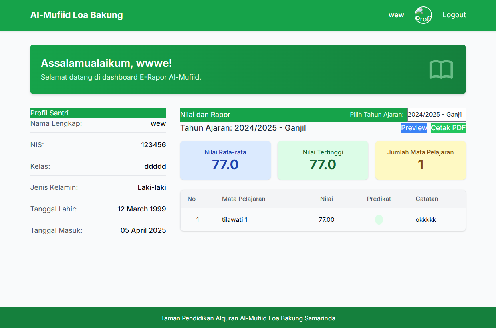

# **Awal Mula Kisah :)**

Dari dulu tertarik dengan istilah software dan ingin tau bagaimana caranya membuat software, dari mencoba membuat blog (tertarik dengan blogging walaupun ini bukan disebut software) hingga ketemu dengan Visual Basic 6.0 dimana software ini bisa membuat aplikasi dengan drag n drop, dari sini mulai mencoba membuat aplikasi tapi tidak mengetahui coding (hanya sekedar tampilan) dan bahkan mencari kode di internet untuk membuat aplikasi lalu copy/paste kode tersebut. Berikut ini adalah software yang pernah saya buat dengan hanya copy/paste heheheheheheh wwkwkwk 🤣🗿🦅🦅🦅🦅🦅🦅🦅🦅🔥🔥🔥🔥🔥

Lalu apa sangkut pautnya dengan istilah baru sekarang dengan Vibe Coding?

## **Vibe Coding !**

Istilah baru yang mulai populer 2025 bersamaan dengan AI Artist wkwk, Vibe Coding pertama kali disinggung oleh Andrej Karpathy, seorang peneliti AI pada tweetnya (sekarang X). Jadi, intinya tuh kayak kamu "nyuruh" AI buat nulis kode berdasarkan apa yang kamu pengen, bukan kamu yang capek-capek mikirin sintaks sama aturan bahasa pemrograman. Kamu cukup kasih "vibe" atau gambaran maunya kamu kayak gimana, terus AI-nya yang nerjemahin jadi kode beneran.

### **Kenapa dibilang "vibe"?**

Karena kamu lebih fokus ke _feel_ atau _suasana_ dari apa yang kamu mau bikin. Kamu tidak perlu pusing sama detail teknisnya. Kamu cuma perlu merasakan, "Oh, aku pengennya aplikasinya tuh kayak gini, warnanya gini, fungsinya gitu." Terus kamu jelaskan itu ke AI, dan dia yang "menangkap vibe" kamu itu buat jadi kode.

**Enaknya apa?**

- **Gampang buat yang tidak jago ngoding:** Kamu tidak perlu kuliah IT dulu buat bikin program sederhana.
- **Cepat:** AI bisa menulis kode jauh lebih kilat daripada manusia. Jadi, bikin prototipe atau aplikasi kecil bisa lebih satset.
- **Fokus ke ide:** Kamu bisa lebih memikirkan konsep aplikasinya daripada ribet sama teknisnya.

**Tidak enaknya apa?**

- **Kadang kodenya tidak jelas:** Karena AI yang bikin, kamu sendiri mungkin bingung itu kode ngapain aja. Jadi, kalau ada error atau mau diubah nanti, bisa pusing.
- **Potensi bug:** Namanya juga buatan mesin, kadang ada aja error atau bug yang kelewat. Kalau kamu tidak mengerti kodenya, mencari bug-nya bisa susah.
- **Kualitas kode:** Kode buatan AI belum tentu yang paling bagus atau paling efisien. Bisa aja boros memori atau lambat.
- **Belum bisa buat yang super kompleks:** Buat aplikasi yang gede dan rumit banget, kayaknya masih butuh campur tangan programmer beneran yang mengerti dalemannya.

## **Mencoba**

Nah dari sini mulai mencoba dengan membuat struktur E Rapot TPQ yang tepat dan bisa memasukkan data santri, menginput nilai untuk beberapa mata pelajaran, melihat rekapitulasi nilai sederhana, dan mencetak rapor individual. serta pembuatan prompt yang cocok untuk diberikan kepada AI. yang perlu diperhatikan adalah :
- **Ketelitian dalam _Prompt_:** Kunci keberhasilan _vibe coding_ terletak pada seberapa jelas dan detail deskripsi yang kita berikan kepada AI. Semakin spesifik _prompt_ kita, semakin akurat pula kode yang dihasilkan.
- **Pemahaman Dasar Logika:** Meskipun _vibe coding_ mengurangi kebutuhan akan penguasaan sintaks, pemahaman dasar tentang logika pemrograman tetap penting untuk memberikan arahan yang tepat kepada AI dan mengevaluasi kode yang dihasilkan.
- **Iterasi dan _Feedback_:** Proses _vibe coding_ bersifat iteratif. Kita perlu terus memberikan _feedback_ kepada AI untuk menyempurnakan kode yang dihasilkan.
- **Potensi Besar untuk Tugas Sederhana:** _Vibe coding_ terbukti sangat efektif untuk menghasilkan aplikasi atau fitur sederhana dengan cepat, terutama untuk kebutuhan personal atau kelompok kecil.

dibawah ini adalah screenshot dari Web E Raport TPQ 



---
## **Penutup**

Pengalaman mencoba *vibe coding* untuk membangun *e-rapor* TPQ ini menjadi bukti awal betapa menarik dan potensialnya pendekatan ini, terutama untuk kebutuhan yang relatif sederhana. Meskipun masih banyak ruang untuk pengembangan dan penyempurnaan, keberhasilan ini memberikan dorongan untuk terus mengeksplorasi pemanfaatan AI dalam membantu proses pengembangan perangkat lunak.

Kode sumber dari prototipe *e-rapor* TPQ ini (dalam versi sangat sederhana) telah diunggah ke GitHub dan dapat diakses melalui tautan berikut:

**Catatan:** Repository ini berisi kode prototipe awal yang dihasilkan melalui *vibe coding*. Kemungkinan besar masih memerlukan pembenahan, penambahan fitur, dan peningkatan kualitas kode untuk penggunaan yang lebih luas.

---